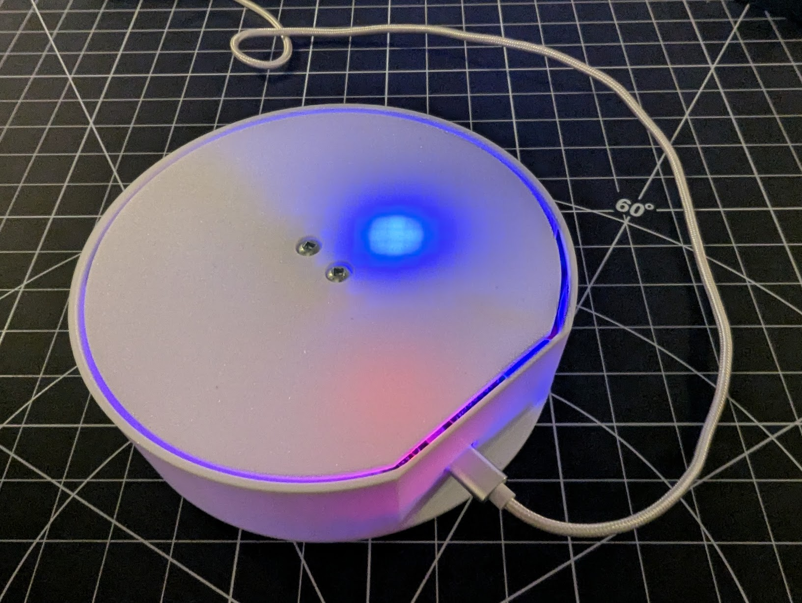
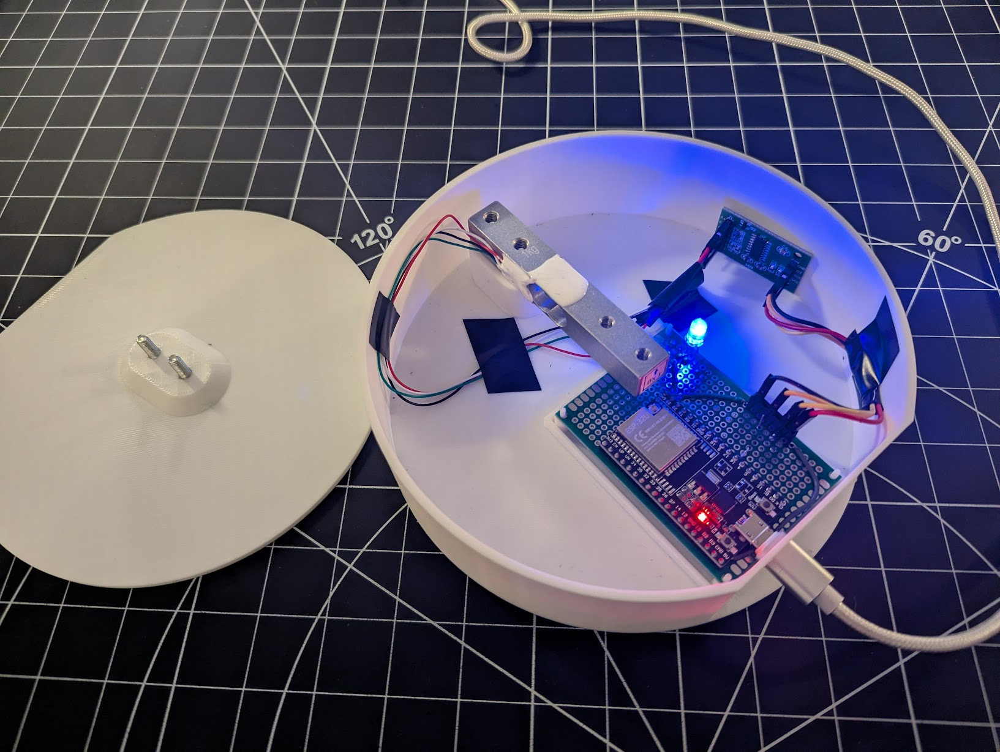
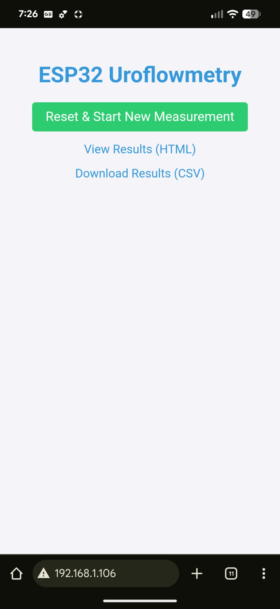
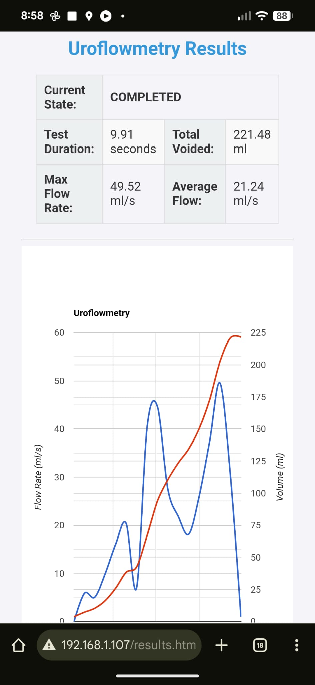

# 💧 ESP32 Uroflowmetry Station

This project transforms an **ESP32** microcontroller and an **HX711** load cell amplifier into a web-enabled Uroflowmetry/Flow-Rate measurement device. It captures weight data over time, calculates the flow rate, and provides a web interface (HTML chart) and a CSV download for result analysis.

## ✨ Features

* **Wireless Data Acquisition:** Uses ESP32 Wi-Fi capabilities to host a web server for control and results.
* **High-Resolution Weighing:** Integrates the **HX711** Load Cell Amplifier for precise weight measurements.
* **Automatic Measurement Control:**
    * **Start Condition:** Measurement automatically begins when a weight greater than the `START_THRESHOLD` is detected.
    * **Stop Condition:** Measurement automatically stops after a period of stable weight (`STOP_TIMEOUT` and `STABILITY_TOLERANCE`).
* **Web Interface:** Serves a simple control page and a results page with an interactive **Google Chart** of Flow Rate and Volume over time.
* **Data Export:** Allows direct download of measurement data as a **CSV** file.
* **Status Indication:** Uses an **RGB LED** to visually indicate the device's current state.

---

## 🛠️ Hardware Requirements

* **ESP32 Development Board** (e.g., ESP32-WROOM-32)
* **HX711 Load Cell Amplifier**
* **1kg Load Cell**
* **RGB LED** or three single LEDs (common cathode/anode, adjust code accordingly)
* **Protoboard (5x7cm)**: Needed for mounting and wiring the components to fit within the case.
* **Power Supply** and associated wiring components.

---

## 📦 3D-Printed Case and Assembly

The project enclosure can be 3D printed using the provided files.

* The required **3mf files** are located in the **`models/`** folder of this repository.
* **Internal Components:** The case is designed to accommodate a **5x7cm protoboard** for mounting the ESP32 and HX711 components.
* **Assembly Hardware:** You will need the following screws for assembly:
    * **2x M4 screws** (16mm length)
    * **2x M5 screws** (16mm length)

---

## 📌 Pin Configuration

The following GPIO pins are used in the provided code.

| Component | Pin (GPIO) | Constant Name |
| :--- | :--- | :--- |
| **HX711 DOUT** | 18 | `LOADCELL_DOUT_PIN` |
| **HX711 SCK** | 16 | `LOADCELL_SCK_PIN` |
| **RGB LED Red** | 22 | `redPin` |
| **RGB LED Green** | 21 | `greenPin` |
| **RGB LED Blue** | 19 | `bluePin` |

---

## ⚙️ Setup and Calibration

### 1. Libraries

This project requires the following Arduino libraries:

* **HX711 Library** (e.g., from Bogdan R. or similar, commonly available in the Arduino Library Manager).
* **WiFi** (built-in for ESP32)
* **WebServer** (built-in for ESP32, usually found as `WebServer.h`)

### 2. Configuration

Before uploading, modify the following constants in the code (`#include <Arduino.h>...` section):

| Constant | Description | Default Value |
| :--- | :--- | :--- |
| `ssid` | Your Wi-Fi network name. | `"xxx"` |
| `password` | Your Wi-Fi network password. | `"xxx"` |
| `CALIBRATION_FACTOR` | **Crucial:** Your load cell's specific calibration value (units per gram). **Must be determined experimentally.** | `-1025.42` |
| `START_THRESHOLD` | Minimum weight (in grams) to begin recording. | `1.0` |
| `STOP_TIMEOUT` | Duration (in ms) of stability before stopping the recording. | `10000` (10 seconds) |
| `STABILITY_TOLERANCE` | Allowable weight change (in grams) during the stop check. | `1.0` |

### 3. Calibration Process

You **must** calibrate your load cell/HX711 setup to find the correct `CALIBRATION_FACTOR`.

1.  Temporarily set `CALIBRATION_FACTOR` to `1.0`.
2.  Upload the code. The serial monitor will show the raw reading.
3.  Place a known weight (e.g., 100g) on the scale.
4.  The value printed to the serial monitor is your **Raw Reading**.
5.  Calculate the factor: **`CALIBRATION_FACTOR` = (Known Weight) / (Raw Reading)**. (Note: The result may be negative depending on your wiring).
6.  Replace the placeholder value with your calculated factor and upload the code again.

---

## 🚀 Usage

1.  **Connect Power:** Power up the ESP32.
2.  **Connect to Wi-Fi:** The device will attempt to connect to the configured Wi-Fi network.
3.  **Find IP:** Check the Serial Monitor to find the assigned **IP Address** or check your router to find the IP.
4.  **Access Web Server:** Open a web browser and navigate to the assigned IP address (e.g., `http://192.168.1.100`).
5.  **Control Page:** Click the **"Reset & Start New Measurement"** button. This tares the scale and sets the state to **IDLE**.
6.  **Measurement:** Place the object to be measured on the scale. Once the weight exceeds the `START_THRESHOLD`, the device will enter the **MEASURING** state and begin logging data.
7.  **Results:** Once the weight is stable for the `STOP_TIMEOUT`, the test will enter the **COMPLETED** state. View or download the results using the links on the main page.

---

## 🚥 Status Colors (RGB LED)

The RGB LED provides a quick visual indication of the system's status:

| State | Color | Description |
| :--- | :--- | :--- |
| `OFFLINE` | **Red** | Wi-Fi is disconnected or attempting to connect. |
| `IDLE` | **Green** | Ready for measurement. Awaiting weight change. |
| `MEASURING` | **Orange** | Actively recording weight and calculating flow rate. |
| `COMPLETED` | **Blue** | Measurement is complete and results are available. |

---

## 🖼️ Pictures

### Device

    
    

### Web interface

    
    

---

## 🤝 Contributing

This project is currently very simple, and contributions are highly encouraged!

If you have suggestions for new features, bug fixes, or improvements to the data processing or web interface, please feel free to open an issue or submit a **Pull Request**.

---

## 📜 License

This project is licensed under the MIT License — see the `LICENSE` file for details.

